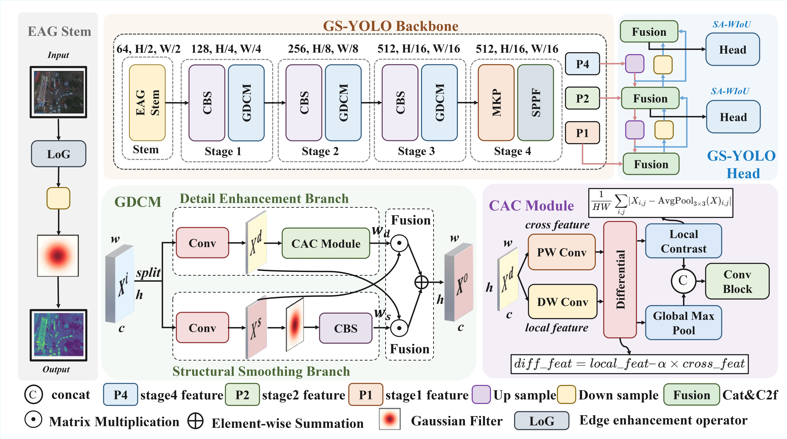

# GS-YOLO: Lightweight and Highly Efficient Real-time Aerial Image Detector

This is the official repository of **GS-YOLO**.

GS-YOLO is a lightweight and efficient real-time aerial image object detector designed for small object detection in complex aerial scenes. It improves the representation of tiny objects while maintaining a favorable trade-off between detection accuracy, computational cost, and model parameters.



## Abstract

Aerial image object detection plays an important role in real-world applications such as urban traffic management, maritime search and rescue, and disaster emergency assessment. However, detecting extremely small objects in aerial images remains challenging due to sparse pixels, blurred edge textures, complex backgrounds, dense object distribution, and low signal-to-noise ratios.

To address these challenges, we propose **GS-YOLO**, a lightweight and highly efficient detection framework for real-time aerial image object detection. GS-YOLO introduces two lightweight modules: the **Edge-Aware Gaussian Downsampling Module (EAG-Stem)** and the **Gaussian Difference Calibration Module (GDCM)**. EAG-Stem enhances edge structure information during early downsampling, while GDCM improves the separability between small targets and background by jointly modeling detail enhancement and structural smoothing information.

In addition, we design a **Scale-Adaptive Weighted IoU (SA-WIoU)** loss function to improve localization accuracy for small objects by dynamically adjusting the optimization weights of targets at different scales.

Extensive experiments on the **VisDrone2019** and **SIMD** datasets demonstrate that GS-YOLO achieves an excellent balance between accuracy, model size, and computational efficiency.

## Highlights

- A lightweight real-time aerial image detector for small object detection.
- **EAG-Stem** enhances edge-aware feature extraction during early-stage downsampling.
- **GDCM** improves target-background separability through Gaussian-guided structural smoothing and detail enhancement.
- **SA-WIoU** strengthens localization supervision for small-scale objects without introducing additional model parameters.
- Competitive performance on **VisDrone2019** and **SIMD** with significantly fewer parameters than many mainstream detectors.

## Main Results

### VisDrone2019

GS-YOLO achieves strong performance on the VisDrone2019 dataset while using significantly fewer parameters.

| Model | AP | AP50 | FLOPs | Params |
|---|---:|---:|---:|---:|
| GS-YOLO-N | 21.2 | 36.0 | 8.4G | 0.8M |
| GS-YOLO-S | 26.4 | 43.5 | 26.9G | 2.7M |
| GS-YOLO-M | 29.1 | 47.0 | 65.9G | 7.0M |
| GS-YOLO-L | 29.8 | 47.9 | 130.4G | 14.2M |
| GS-YOLO-X | 30.3 | 48.8 | 201.7G | 22.2M |

### SIMD

GS-YOLO-M also achieves competitive performance on the SIMD dataset.

| Model | AP | AP50 | FLOPs | Params |
|---|---:|---:|---:|---:|
| GS-YOLO-M | 67.0 | 82.5 | 65.9G | 7.0M |

## Requirements

The recommended environment is listed below.

```bash
ultralytics>=8.0.0
torch>=2.0.0
opencv-python>=4.8.0
numpy>=1.24.0
python >= 3.8
torchvision
numpy
scipy
matplotlib
pyyaml
tqdm
pillow
````

The experiments in our paper were conducted on an NVIDIA GeForce RTX 4090 GPU.

You can install the required packages with:

```bash
pip install -r requirements.txt
```

## Dataset Preparation

GS-YOLO is evaluated on two aerial image object detection datasets:

* **VisDrone2019**
* **SIMD**

Please download the datasets from their official sources and organize them in YOLO format.

A recommended directory structure is:

```text
datasets/
├── VisDrone2019/
│   ├── images/
│   │   ├── train/
│   │   ├── val/
│   │   └── test/
│   └── labels/
│       ├── train/
│       ├── val/
│       └── test/
│
└── SIMD/
    ├── images/
    │   ├── train/
    │   └── test/
    │   
    └── labels/
        ├── train/
        └── test/
        
```

Each dataset should have a corresponding YAML configuration file, for example:

```text
data/
├── visdrone.yaml
└── simd.yaml
```

An example dataset configuration file:

```yaml
path: ./datasets/VisDrone2019
train: images/train
val: images/val
test: images/test

nc: 10
names:
  - pedestrian
  - people
  - bicycle
  - car
  - van
  - truck
  - tricycle
  - awning-tricycle
  - bus
  - motor
```

Please modify the dataset path and class names according to your local dataset settings.

## Training

To train GS-YOLO on VisDrone2019, run:

```bash
python train.py --data data/visdrone.yaml --cfg models/gs-yolo.yaml --weights '' --batch 4 --epochs 300 --img 640
```

To train on SIMD, run:

```bash
python train.py --data data/simd.yaml --cfg models/gs-yolo.yaml --weights '' --batch 4 --epochs 300 --img 640
```

You can also specify the GPU device:

```bash
CUDA_VISIBLE_DEVICES=0 python train.py --data data/visdrone.yaml --cfg models/gs-yolo.yaml --batch 4 --epochs 300 --img 640
```

## Acknowledgements

This project is built upon the YOLO series object detection framework. We sincerely thank the authors and contributors of YOLOv8, VisDrone2019, SIMD, and other related open-source projects.
